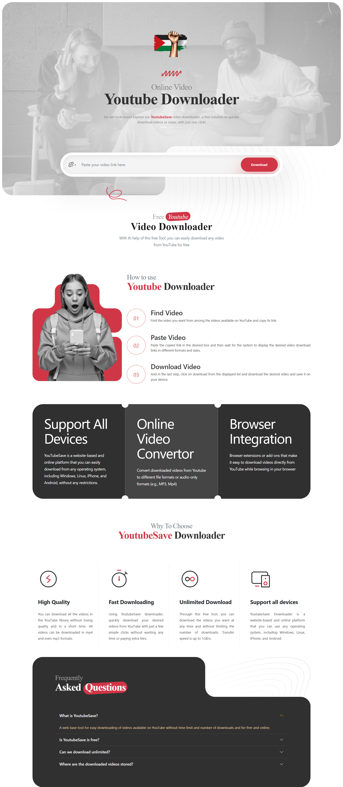
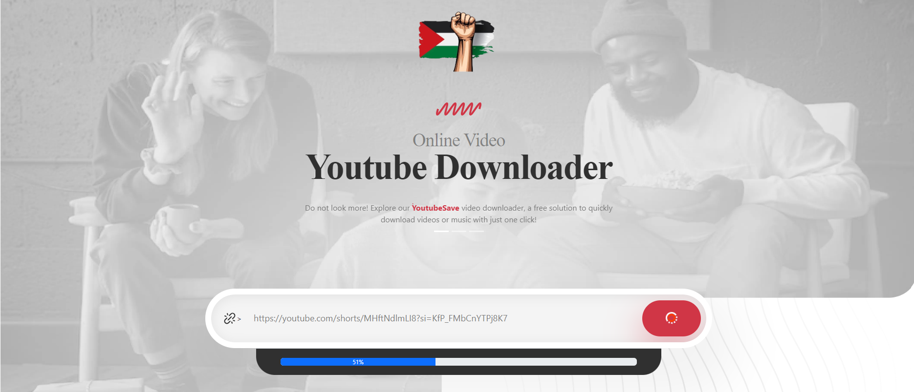

# YouTube Downloader GUI

## Description

YouTube downloader Save is a Website tool that allows users to download videos from YouTube onto their devices. These downloaders typically work by copying the video's URL and pasting it into the downloader interface, which then retrieves the video file and saves it locally on the user's device. This enables users to watch the videos offline, without needing an internet connection, and often allows them to save videos for future reference or sharing with others.

it is cross-platform (Windows, Mac, Linux) and can be used in any terminal.

> **Note:** This project is still in development.

## Inspiration

This project was inspired by [uTube Save](https://github.com/omer73364/uTube/) by [omer73364](https://github.com/omer73364) 🤓

## Features

- Support All Devices
- Download a single YouTube in video format.
- Download YouTube shorts.
- user-friendly making it easy for users to navigate and download videos from YouTube.

## TODO

- [x] Support GUI.
- [x] Support downloading video (360p format).
- [x] Support shorts.
- [ ] Support all available formats.
- [ ] Supports downloading playlists.
- [ ] Playlists organized into folders by their names.
- [ ] Add convert videos into mp3 format.
- [ ] Any features that you/I can think of.

## Installation

## Clone the repository

```bash
https://github.com/MohdFahd/uTube-Save.git
```

### Client

```bash
npm i || npm install
```

## Run commands

```
npm run dev
```

### Server

```bash
npm i || npm install
```

## Run commands

```
node index
```

## Usage

Easy to download, just paste the url and enjoy

## Preview
<div style="text-align: center;">
    
    <br />
    <br />
    
    <br />
    <br />

</div>

## Contributing

Pull requests are welcome. For major changes, please open an issue first to discuss what you would like to change.
please follow the contributing guidelines.
